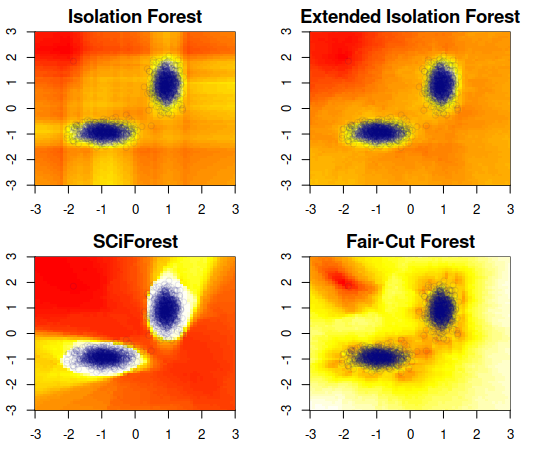
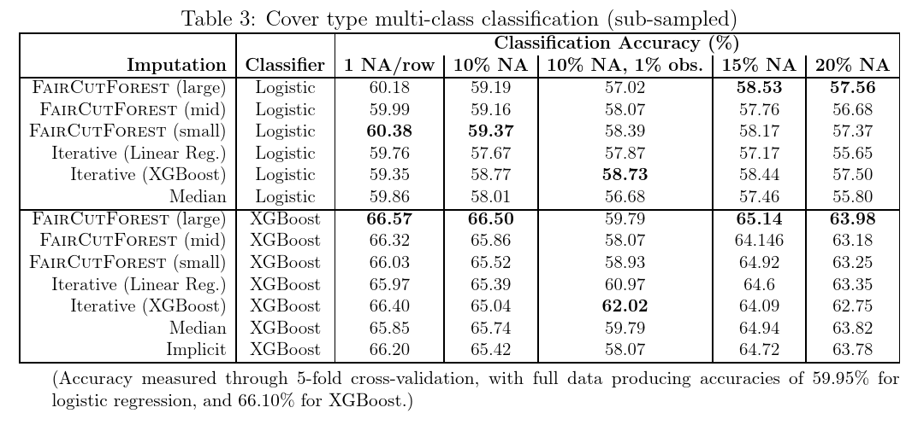

# IsoTree

Fast and multi-threaded implementation of Extended Isolation Forest, Fair-Cut Forest, SCiForest (a.k.a. Split-Criterion iForest), and regular Isolation Forest, for outlier/anomaly detection, plus additions for imputation of missing values, distance/similarity calculation between observations, and handling of categorical data. Written in C++ with interfaces for Python and R.

The new concepts in this software are described in:
* [Imputing missing values with unsupervised random trees](https://arxiv.org/abs/1911.06646)
* [Distance approximation using Isolation Forests](https://arxiv.org/abs/1910.12362)

# Description

Isolation Forest is an algorithm originally developed for outlier detection that consists in splitting sub-samples of the data according to some attribute/feature/column at random. The idea is that, the rarer the observation, the more likely it is that a random uniform split on some feature would put outliers alone in one branch, and the fewer splits it will take to isolate an outlier observation like this. The concept is extended to splitting hyperplanes in the extended model (i.e. splitting by more than one column at a time), and to guided (not entirely random) splits in the SCiForest model that aim at isolating outliers faster and finding clustered outliers.

Note that this is a black-box model that will not produce explanations or importances - for a different take on explainable outlier detection see [OutlierTree](https://www.github.com/david-cortes/outliertree).



_(Code to produce these plots can be found in the R examples in the documentation)_




# Distance / similarity calculations

General idea was extended to produce distance (alternatively, similarity) between observations according to how many random splits it takes to separate them - idea is described in [Distance approximation using Isolation Forests](https://arxiv.org/abs/1910.12362).

# Imputation of missing values

The model can also be used to impute missing values in a similar fashion as kNN, by taking the values from observations in the terminal nodes of each tree in which an observation with missing values falls at prediction time, combining the non-missing values of the other observations as a weighted average according to the depth of the node and the number of observations that fall there. This is not related to how the model handles missing values internally, but is rather meant as a faster way of imputing by similarity. Quality is usually not as good as chained equations, but the method is a lot faster and more scalable. Recommended to use non-random splits when used as an imputer. Details are described in [Imputing missing values with unsupervised random trees](https://arxiv.org/abs/1911.06646).

# Highlights

There's already many available implementations of isolation forests for both Python and R (such as [the one from the original paper's authors'](https://sourceforge.net/projects/iforest/) or [the one in SciKit-Learn](https://scikit-learn.org/stable/modules/generated/sklearn.ensemble.IsolationForest.html)), but at the time of writing, all of them are lacking some important functionality and/or offer sub-optimal speed. This particular implementation offers the following:

* Implements the extended model (with splitting hyperplanes) and split-criterion model (with non-random splits).
* Can use a mixture of random and non-random splits, and can split by weighted/pooled gain (in addition to simple average).
* Can produce approximated pairwise distances between observations according to how many steps it takes on average to separate them down the tree.
* Can handle missing values (but performance with them is not so good).
* Can produce missing value imputations according to observations that fall on each terminal node.
* Can handle categorical variables (one-hot/dummy encoding does not produce the same result).
* Can work with sparse matrices.
* Supports sample/observation weights, either as sampling importance or as distribution density measurement.
* Supports user-provided column sample weights.
* Can sample columns randomly with weights given by kurtosis.
* Uses exact formula (not approximation as others do) for harmonic numbers at lower sample and remainder sizes.
* Can fit trees incrementally to user-provided data samples.
* Produces serializable model objects with reasonable file sizes.
* Fast and multi-threaded C++ code. Can be wrapped in languages other than Python and R.

(Note that categoricals, NAs, and density-like sample weights, are treated heuristically with different options as there is no single logical extension of the original idea to them, and having them present might degrade performance/accuracy for regular numerical non-missing observations)

# Installation

* Python:
```python
pip install isotree
```

* R:
```r
install.packages("isotree")
```

* C++: package doesn't have a build system, nor a main function that can produce an executable, but can be built as a shared object and wrapped into other languages with any C++11-compliant compiler (`-std=c++11` in most compilers, `/std:c++14` in MSVC). For parallelization, needs OpenMP linkage (`-fopenmp` in most compilers, `/openmp` in MSVC). Package should not be built with optimization higher than `O3` (i.e. don't use `-Ofast`). Needs linkage to the math library, which should be enabled by default in most C++ compilers, but otherwise would require `-lm` argument. No external dependencies are required.

# Sample usage

**Warning: default parameters in this implementation are very different from default parameters in others such as SciKit-Learn's, and these defaults won't scale to large datasets (see documentation for details).**

* Python:

```python
import numpy as np
from isotree import IsolationForest

### Random data from a standard normal distribution
np.random.seed(1)
n = 100
m = 2
X = np.random.normal(size = (n, m))

### Will now add obvious outlier point (3, 3) to the data
X = np.r_[X, np.array([3, 3]).reshape((1, m))]

### Fit a small isolation forest model
iso = IsolationForest(ntrees = 10, ndim = 2, nthreads = 1)
iso.fit(X)

### Check which row has the highest outlier score
pred = iso.predict(X)
print("Point with highest outlier score: ",
      X[np.argsort(-pred)[0], ])
```

* R:
(see documentation for more examples - `help(isotree::isolation.forest)`)
```r
### Random data from a standard normal distribution
library(isotree)
set.seed(1)
n <- 100
m <- 2
X <- matrix(rnorm(n * m), nrow = n)

### Will now add obvious outlier point (3, 3) to the data
X <- rbind(X, c(3, 3))

### Fit a small isolation forest model
iso <- isolation.forest(X, ntrees = 10, nthreads = 1)

### Check which row has the highest outlier score
pred <- predict(iso, X)
cat("Point with highest outlier score: ",
	X[which.max(pred), ], "\n")
```

# Examples

* Python: [[example notebook](https://nbviewer.jupyter.org/github/david-cortes/isotree/blob/master/example/isotree_example.ipynb)], [[example as imputer in sklearn pipeline](https://nbviewer.jupyter.org/github/david-cortes/isotree/blob/master/example/isotree_impute.ipynb)].
* R: examples available in the documentation (`help(isotree::isolation.forest)`, [link to CRAN](https://cran.r-project.org/web/packages/isotree/index.html)).

# Documentation

* Python: documentation is available at [ReadTheDocs](http://isotree.readthedocs.io/en/latest/).
* R: documentation is available internally in the package (e.g. `help(isolation.forest)`) and in [CRAN](https://cran.r-project.org/web/packages/isotree/index.html).
* C++: documentation is available in the source files (not the header).

# Known issues

Random seeds do not give fully-reproducible results when using more than one thread. Same for imputations, mostly due to numerical rounding differences. These issues are not present when running single-threaded.

# References

* Liu, Fei Tony, Kai Ming Ting, and Zhi-Hua Zhou. "Isolation forest." 2008 Eighth IEEE International Conference on Data Mining. IEEE, 2008.
* Liu, Fei Tony, Kai Ming Ting, and Zhi-Hua Zhou. "Isolation-based anomaly detection." ACM Transactions on Knowledge Discovery from Data (TKDD) 6.1 (2012): 3.
* Hariri, Sahand, Matias Carrasco Kind, and Robert J. Brunner. "Extended Isolation Forest." arXiv preprint arXiv:1811.02141 (2018).
* Liu, Fei Tony, Kai Ming Ting, and Zhi-Hua Zhou. "On detecting clustered anomalies using SCiForest." Joint European Conference on Machine Learning and Knowledge Discovery in Databases. Springer, Berlin, Heidelberg, 2010.
* https://sourceforge.net/projects/iforest/
* https://math.stackexchange.com/questions/3388518/expected-number-of-paths-required-to-separate-elements-in-a-binary-tree
* Quinlan, J. Ross. C4. 5: programs for machine learning. Elsevier, 2014.
* Cortes, David. "Distance approximation using Isolation Forests." arXiv preprint arXiv:1910.12362 (2019).
* Cortes, David. "Imputing missing values with unsupervised random trees." arXiv preprint arXiv:1911.06646 (2019).
